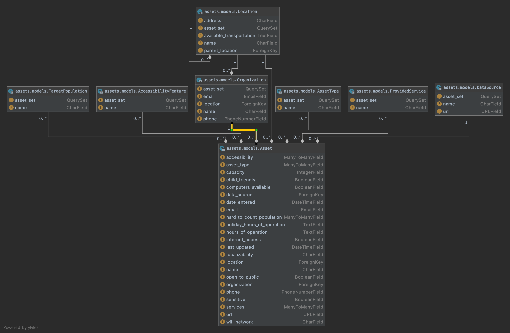

# asset-hound
Version 0.1 of a schema for asset-map data

## Installation
1. Clone this repo `git clone https://github.com/WPRDC/asset-hound`
2. Move to project directory `cd asset-hound`
3. Install requirements `pip install -r requirements.txt`
4. Rename `local_settings.py.example`to `local_settings.py` and update it to match your requirements.

## UML Diagram
